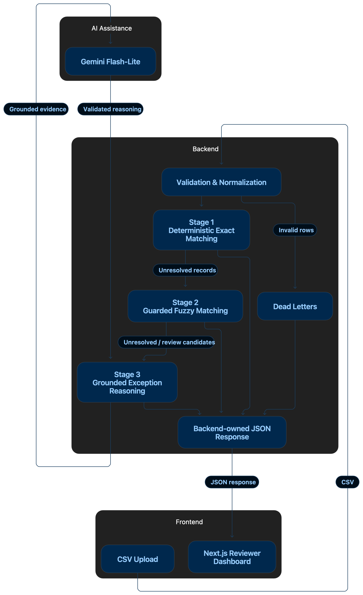

# AI Finance Controller

> **Razorpay AI Buildathon 2026 — Track 04: AI Finance Controller**

AI Finance Controller is a deterministic-first reconciliation system for merchant ledger data, Razorpay payment/settlement data, and bank statements. It resolves the cases that can be proved with rules first, then uses Gemini only for the smaller set of unresolved cases that need explanation or reviewer assistance.

**Live Demo:** https://ai-finance-controller-git-main-m-riyaan.vercel.app/  
**Backend / Swagger:** https://ai-finance-controller-826949991342.asia-south1.run.app/docs  
**GitHub:** https://github.com/mRiyaan/ai-finance-controller

---

## What it solves

A merchant sees individual orders in an internal ledger. Razorpay sees payment/refund/adjustment activity and groups money into settlements. The bank ultimately shows the payout as an aggregate credit.

The problem is not simply finding similar IDs. The system has to prove the financial relationship:

- merchant order ↔ Razorpay payment
- Razorpay settlement ↔ bank credit
- gross/fee/tax deductions ↔ expected net payout
- unresolved records ↔ an explicit reason and evidence

The implementation therefore follows one rule throughout the project:

> **Use deterministic controls to decide what happened. Use AI to help explain what could not be resolved.**

---

## Why this is a Track 04 fit

The project closes one concrete finance-ops loop across a multi-source batch and reports both successful reconciliation and unresolved exceptions.

It covers:

- 50+ record synthetic reconciliation
- merchant + Razorpay + bank inputs
- exact matching
- constrained fuzzy matching
- settlement reconciliation
- explicit amount/date/identifier gates
- grounded LLM assistance for unresolved records
- human review routing
- dead-letter preservation for invalid rows
- measurable batch outcomes
- a public, deployable application rather than a notebook-only prototype

The design intentionally avoids a multi-agent workflow because financial reconciliation needs a small, auditable decision path rather than autonomous orchestration. More detail is in [`docs/ARCHITECTURE.md`](docs/ARCHITECTURE.md).

---

## How the system works



Stage 1 and Stage 2 own financial truth. Stage 3 does not rewrite their results, and the frontend does not recalculate reconciliation. See [`docs/RECONCILIATION_PIPELINE.md`](docs/RECONCILIATION_PIPELINE.md).

---


## What makes the AI safe here

The LLM is not the reconciliation engine.

Gemini is only called for unresolved records after deterministic processing. Stage 3 receives selected, trusted evidence from Stage 2 and returns constrained structured output.

The backend then checks things such as:

- allowed LLM status
- reported amount consistency
- identifier/token consistency
- deterministic failed gates
- required human approval
- safe fallback behavior

The allowed decision vocabulary is intentionally narrow:

```text
STRONG_POTENTIAL_MATCH
EXCEPTION
NEEDS_MANUAL_REVIEW
```

A Gemini response cannot turn a deterministic exception into a financial match by itself.

---

## Transparency

The reviewer UI exposes:

- exact backend-approved matches
- fuzzy matches and their status
- amount mismatches
- settlement mismatches
- Stage 3 reasoning
- source/candidate evidence
- similarity score
- amount/date variance
- failed gates
- CSV lookup keys
- dead letters
- original invalid CSV rows

Dead letters are preserved instead of being silently discarded. The frontend provides expandable original-record evidence so a reviewer can see what the parser actually received.

---


## Stack

**Backend**

Python 3.13, FastAPI, Pandas, Pydantic v2, RapidFuzz, python-dateutil, pytest, Google GenAI.

**Frontend**

Next.js App Router, JavaScript/JSX, Tailwind CSS, npm.

**Deployment**

- Frontend: Vercel
- Backend: Docker + Google Cloud Run
- Secrets: Google Cloud Secret Manager

---

## Why these technologies

The stack was selected around the type of problem being solved, not because each tool is popular in isolation. This application processes structured financial records, so the important requirements are exact arithmetic, traceable decisions, safe handling of ambiguity and a simple reviewer workflow.

### Python + Pandas

Python is well suited to a data-processing service with clear, testable reconciliation stages. Pandas provides the practical table operations needed for this project: reading the three CSV inputs, normalizing columns, joining ledger records to Razorpay records, aggregating transactions by `settlement_id`, and preparing bank comparisons.

Pandas is used for data preparation and comparison; it is not treated as a black-box matching system. Financial decisions are made by explicit application rules, with currency converted once into integer paise so that equality and tolerance checks do not depend on floating-point arithmetic.

### FastAPI

FastAPI gives the pipeline a small, explicit HTTP boundary. It accepts the three uploaded files, runs the same backend-owned reconciliation flow for every request, returns a documented JSON contract and exposes Swagger UI for manual API verification. This fits the MVP because the product is a stateless upload-and-review tool rather than a long-running transaction platform.

### Pydantic

Pydantic separates unreliable external CSV values from trusted internal records. Each row is validated and normalized before it reaches the matching logic, while malformed rows are retained as dead letters instead of being silently dropped. The same validation approach also constrains Stage 3 Gemini responses before they can reach the reviewer UI.

### RapidFuzz

Real exports can contain small identifier errors, such as a truncated UTR or a minor order-ID typo. RapidFuzz is used only for these unresolved cases, after exact matching has finished. Its similarity score is combined with amount, date and uniqueness gates, so a similar-looking identifier alone can never create a financial match.

### Gemini through the Google GenAI SDK

Gemini is deliberately limited to Stage 3. It receives the selected candidate and trusted deterministic evidence for cases that the rules could not resolve. Its job is to explain the evidence and suggest a bounded review state, not to calculate settlement amounts, choose a different candidate or overwrite Stage 1/Stage 2 results. Structured output validation and deterministic fallbacks keep model failure safe.

### Next.js, JavaScript and Tailwind CSS

Next.js App Router provides a straightforward way to build the reviewer dashboard and deploy it to Vercel. JavaScript/JSX keeps the MVP lightweight while the backend remains the source of truth for all financial values. Tailwind CSS makes it practical to present several result types consistently: exact matches, fuzzy candidates, amount mismatches, Stage 3 recommendations and dead letters.

### Docker, Cloud Run and Vercel

Docker packages the FastAPI service with a reproducible runtime, and Cloud Run provides a simple deployment target that matches the backend's stateless request model. Vercel is a natural fit for the Next.js frontend. Together, they keep deployment small and public without introducing servers or infrastructure that the MVP does not need.

### pytest

Reconciliation is rule-heavy, so regression tests are important. The test suite covers exact matches, amount mismatches, fuzzy-match gates, malformed input, settlement aggregation and Stage 3 validation/fallback behavior. This makes changes measurable and helps protect the financial boundary as the project evolves.

### Why there is no database, vector database or multi-agent framework

The MVP processes an uploaded batch in memory and returns a complete result for that request. It does not yet need persistent cases, cross-request reviewer history or semantic document retrieval. IDs, amounts, fees, taxes and UTRs are structured facts, so direct lookup is more accurate and auditable than embeddings. The decision path is also intentionally short:

```text
deterministic evidence → one bounded reasoning step → validation → human review
```

Adding a database, vector search or multiple agents would increase operational and reasoning complexity without improving the core financial-control guarantee required by this MVP.

---

## Testing

The finalized backend test suite was verified with:

```text
65 tests passed
```

The project was also manually exercised through Swagger and through the deployed Cloud Run endpoint using the adversarial CSV batch.

The current production deployment returned HTTP 200 and produced the batch summary shown above.

See [`docs/EVALUATION_AND_TESTING.md`](docs/EVALUATION_AND_TESTING.md).

---

## Deployment status

**Frontend**

https://ai-finance-controller-git-main-m-riyaan.vercel.app/

**Backend**

https://ai-finance-controller-826949991342.asia-south1.run.app/

**Swagger**

https://ai-finance-controller-826949991342.asia-south1.run.app/docs

The production frontend uses the Cloud Run backend through the `NEXT_PUBLIC_API_URL` environment variable.

---

## Running locally

### Backend

```bash
cd backend

python -m venv venv
source venv/bin/activate

pip install -r requirements.txt

uvicorn app.main:app --reload --port 8000
```

Swagger:

```text
http://127.0.0.1:8000/docs
```

### Frontend

```bash
cd frontend
npm install
npm run dev
```

Local frontend configuration:

```text
NEXT_PUBLIC_API_URL=http://localhost:8000
```

### Tests

```bash
cd backend
pytest -q
```

### Docker

```bash
cd backend
docker build -t ai-finance-controller .
docker run --rm -p 8080:8080 ai-finance-controller
```

---

## Sample data

The repository contains two useful categories of data:

1. **Baseline / initial dataset** — useful for demonstrating the intended reconciliation flow.
2. **Adversarial dataset** — deliberately contains edge cases that exercise the exception, validation and Stage 3 paths.

The adversarial dataset is especially important for the project because the Buildathon asks for an honest exception list rather than a cherry-picked happy path.


---

## Documentation

- [`docs/ARCHITECTURE.md`](docs/ARCHITECTURE.md) — system design, trust boundaries and technology choices
- [`docs/RECONCILIATION_PIPELINE.md`](docs/RECONCILIATION_PIPELINE.md) — Stage 1, Stage 2 and Stage 3 in detail
- [`docs/PROBLEMS_AND_SOLUTIONS.md`](docs/PROBLEMS_AND_SOLUTIONS.md) — the major technical problems encountered and how they were resolved
- [`docs/EVALUATION_AND_TESTING.md`](docs/EVALUATION_AND_TESTING.md) — tests, batch results and what the numbers do and do not prove
- [`docs/DEPLOYMENT.md`](docs/DEPLOYMENT.md) — local setup, Docker, Cloud Run and Vercel deployment

---

## Closing principle

In finance operations, trustworthy automation is not about forcing every record into a match. It is about proving the relationships that can be verified, preserving the evidence for every unresolved case and making the system's limits visible to the reviewer.

This project is deliberately built around that idea:

> **Backend rules establish financial truth. Evidence makes exceptions understandable. Gemini assists with explanation, while the human reviewer retains the final authority.**
