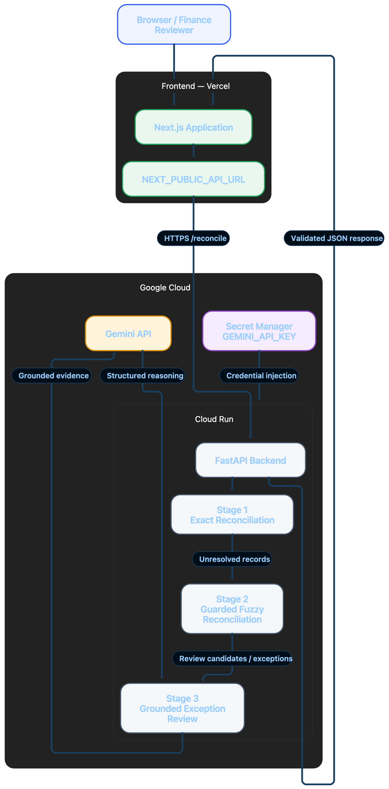
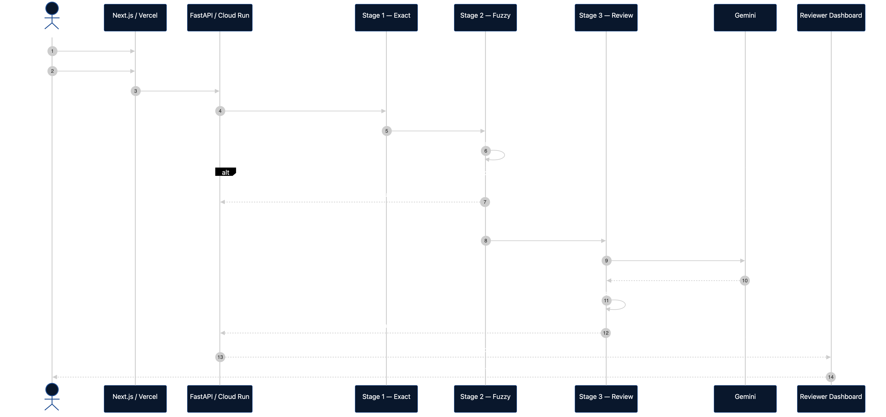

# Architecture

## 1. System at a glance

AI Finance Controller is a small, stateless reconciliation system with a strict trust boundary between deterministic financial logic and AI-assisted exception reasoning.


This diagram shows the trust boundary clearly: deterministic backend stages produce the financial result, Gemini only assists with unresolved evidence, and the frontend displays the validated response for human review.

---

## 2. Data ownership

Three sources play different roles.

### Merchant ledger

Owns the individual order/invoice view:

- merchant order ID
- gateway order ID
- gross amount
- order timestamp
- customer reference
- order status
- source system

### Razorpay settlement report

Owns processor-side payment and settlement facts:

- transaction entity
- entity ID
- amount
- fee
- tax
- debit
- credit
- order ID
- settlement ID
- settlement timestamp
- settlement UTR

The project uses the report's actual fee and tax fields rather than assuming a flat MDR.

### Bank statement

Owns the actual bank-side credit:

- transaction date
- value date
- description
- reference / UTR
- debit
- credit
- balance

When the dedicated bank reference field is empty, the pipeline can deterministically extract a UTR-shaped value from the narration.

---

## 3. Canonical data boundary

Raw CSV values are not treated as authoritative application types.

At ingestion:

```text
"2499.00" rupees
      ↓
249900 integer paise
```

After that boundary, authoritative monetary calculations use integer paise.

This was important enough to become a project-wide rule after a real failure where canonical paise values were accidentally converted a second time.

---

## 4. Stage 1 — deterministic exact reconciliation

Stage 1 answers the easy questions with hard rules.

### Ledger → Razorpay

```text
ledger.gateway_order_id == razorpay.order_id
AND
ledger.gross_amount_paise == razorpay.amount_paise
```

Exact identifier + exact amount becomes an exact match.

Exact identifier + different amount becomes an amount mismatch.

No exact identifier moves to Stage 2.

### Settlement → bank

First calculate the expected net settlement:

```text
expected_net =
    sum(amount)
  - sum(fee)
  - sum(tax)
```

Then compare:

```text
settlement_utr == bank.utr
AND
expected_net == bank.credit
```

An exact UTR with even a 1-paisa difference remains a Stage 1 settlement amount mismatch. The Stage 2 500-paise tolerance does not retroactively weaken the exact-match rule.

---

## 5. Stage 2 — constrained fuzzy reconciliation

Stage 2 is not a generic similarity search.

It only sees Stage 1 leftovers and applies multiple gates.

Current controls:

```text
AUTO threshold:     0.85
POTENTIAL floor:    0.75
AMOUNT tolerance:   500 paise
DATE offset:        3 days
```

The same general structure is used for order IDs and settlement UTRs.

### Three outcomes

**Auto-match**

```text
score >= 0.85
amount passes
date passes or is unavailable
```

**Potential fuzzy candidate**

```text
0.75 <= score < 0.85
amount passes
date passes or is unavailable
```

**Exception**

Anything that fails a hard financial gate or has insufficient evidence.

The full `failed_gates` list is preserved, with finance-first priority:

1. `AMOUNT_MISMATCH`
2. `DATE_OFFSET_EXCEEDED`
3. `LOW_FUZZY_SCORE`
4. `BELOW_AUTO_MATCH_THRESHOLD`

That ordering matters because a candidate can fail more than one condition and the reviewer should see all of them.

---

## 6. Stage 3 — bounded Gemini assistance

Stage 3 is intentionally narrow.

It consumes the Stage 2 handoff and its selected `review_evidence`. It does not independently search the candidate space again.

The model receives grounded evidence and produces constrained structured output.

Allowed statuses:

```text
STRONG_POTENTIAL_MATCH
EXCEPTION
NEEDS_MANUAL_REVIEW
```

The backend then checks the response.

Examples:

- reported amount must agree with trusted evidence
- identifiers/tokens must be structurally valid
- strong potential recommendations require human approval
- an amount/date hard-gate failure blocks a strong recommendation
- model/API/validation failure becomes deterministic manual review

The frontend never treats Gemini text as an authoritative financial record.

---

## 7. Trust boundaries

| Layer | Responsibility | Can change financial truth? |
|---|---|---|
| CSV ingestion | Parse and validate input | No |
| Stage 1 | Exact reconciliation | Yes — deterministic result |
| Stage 2 | Guarded fuzzy reconciliation | Yes — only through explicit deterministic gates |
| Stage 3 | Explain unresolved evidence | No |
| Gemini | Language reasoning | No |
| Frontend | Display + session review actions | No |
| Human reviewer | Approve/reject unresolved case | Only at review layer |

This is the central architectural decision of the project.

---

## 8. Why there is no LangGraph or multi-agent layer

A reconciliation request does not need autonomous agents to decide what to do next.

The flow is already explicit:

```text
exact rules
   ↓
fuzzy rules
   ↓
exception reasoning
   ↓
human review
```

A graph framework would add orchestration overhead without improving the important property: an auditable relationship between the source record, deterministic evidence and final review state.

For the same reason, the MVP does not use:

- vector databases
- embeddings
- RAG over financial IDs
- persistent agent memory

These records are primarily structured financial facts, not a semantic knowledge-retrieval problem.

---

## 9. Frontend boundary

The frontend receives backend-owned JSON and renders it.

It can:

- format trusted paise as INR
- show tables
- expand evidence
- maintain session-only reviewer state

It should not:

- recalculate reconciliation
- reinterpret score thresholds
- invent candidate IDs
- derive results from Gemini prose
- mutate Stage 1/2 outcomes

This separation is why the UI can remain relatively simple while still being transparent.

---

## 10. Deployment architecture



The frontend is deployed to Vercel and uses `NEXT_PUBLIC_API_URL` to call the FastAPI backend on Cloud Run. The backend runs the three reconciliation stages, sends grounded evidence to the Gemini API only for unresolved cases, and returns a validated JSON response to the reviewer dashboard. `GEMINI_API_KEY` is supplied through Google Cloud Secret Manager rather than being stored in the frontend.

### Request sequence



This sequence shows how a reconciliation request moves from the finance reviewer through the Next.js frontend and FastAPI backend. Exact and fuzzy stages can return backend-approved results directly; only unresolved cases continue to grounded Gemini review before the validated JSON response is returned to the dashboard.

---

## 11. Technology rationale

**FastAPI** was chosen because the backend is a compact HTTP service around a Python data-processing pipeline.

**Pandas** is used for CSV ingestion, joins, filtering, aggregation and reconciliation preparation.

**Pydantic v2** provides the canonical typed models and protects the boundary between raw rows and structured records.

**RapidFuzz** is used for the limited identifier-similarity problem in Stage 2.

**Next.js** provides the single-page reviewer dashboard with a straightforward deployment target on Vercel.

**Gemini** is used only after deterministic processing, where natural-language reasoning is useful but should not be trusted as the financial authority.

**Docker + Cloud Run** provide a reproducible backend deployment without adding a large infrastructure layer.

## Why these technologies

The stack was selected around the type of problem being solved, not because each tool is popular in isolation. This application processes structured financial records, so the important requirements are exact arithmetic, traceable decisions, safe handling of ambiguity and a simple reviewer workflow.

### Python + Pandas

Python is well suited to a data-processing service with clear, testable reconciliation stages. Pandas provides the practical table operations needed for this project: reading the three CSV inputs, normalizing columns, joining ledger records to Razorpay records, aggregating transactions by `settlement_id`, and preparing bank comparisons.

Pandas is used for data preparation and comparison; it is not treated as a black-box matching system. Financial decisions are made by explicit application rules, with currency converted once into integer paise so that equality and tolerance checks do not depend on floating-point arithmetic.

### FastAPI

FastAPI gives the pipeline a small, explicit HTTP boundary. It accepts the three uploaded files, runs the same backend-owned reconciliation flow for every request, returns a documented JSON contract and exposes Swagger UI for manual API verification. This fits the MVP because the product is a stateless upload-and-review tool rather than a long-running transaction platform.

### Pydantic

Pydantic separates unreliable external CSV values from trusted internal records. Each row is validated and normalized before it reaches the matching logic, while malformed rows are retained as dead letters instead of being silently dropped. The same validation approach also constrains Stage 3 Gemini responses before they can reach the reviewer UI.

### RapidFuzz

Real exports can contain small identifier errors, such as a truncated UTR or a minor order-ID typo. RapidFuzz is used only for these unresolved cases, after exact matching has finished. Its similarity score is combined with amount, date and uniqueness gates, so a similar-looking identifier alone can never create a financial match.

### Gemini through the Google GenAI SDK

Gemini is deliberately limited to Stage 3. It receives the selected candidate and trusted deterministic evidence for cases that the rules could not resolve. Its job is to explain the evidence and suggest a bounded review state, not to calculate settlement amounts, choose a different candidate or overwrite Stage 1/Stage 2 results. Structured output validation and deterministic fallbacks keep model failure safe.

### Next.js, JavaScript and Tailwind CSS

Next.js App Router provides a straightforward way to build the reviewer dashboard and deploy it to Vercel. JavaScript/JSX keeps the MVP lightweight while the backend remains the source of truth for all financial values. Tailwind CSS makes it practical to present several result types consistently: exact matches, fuzzy candidates, amount mismatches, Stage 3 recommendations and dead letters.

### Docker, Cloud Run and Vercel

Docker packages the FastAPI service with a reproducible runtime, and Cloud Run provides a simple deployment target that matches the backend's stateless request model. Vercel is a natural fit for the Next.js frontend. Together, they keep deployment small and public without introducing servers or infrastructure that the MVP does not need.

### pytest

Reconciliation is rule-heavy, so regression tests are important. The test suite covers exact matches, amount mismatches, fuzzy-match gates, malformed input, settlement aggregation and Stage 3 validation/fallback behavior. This makes changes measurable and helps protect the financial boundary as the project evolves.

---

## 12. Main source files

```text
backend/app/cleaners.py
backend/app/schemas.py
backend/app/stage1_exact_match.py
backend/app/stage2_fuzzy_match.py
backend/app/stage3_exception_reasoner.py
backend/app/main.py
```

Frontend:

```text
frontend/src/app/
frontend/src/components/
frontend/src/lib/
```

Key reviewer components include summary metrics, deterministic results, matched-record audit sections, Stage 3 reviewer queues, evidence drill-down and dead-letter expansion.

---

## 13. Design principle

The architecture can be reduced to one sentence:

> **Deterministic code decides financial facts; AI explains unresolved evidence; humans retain the final review authority.**
